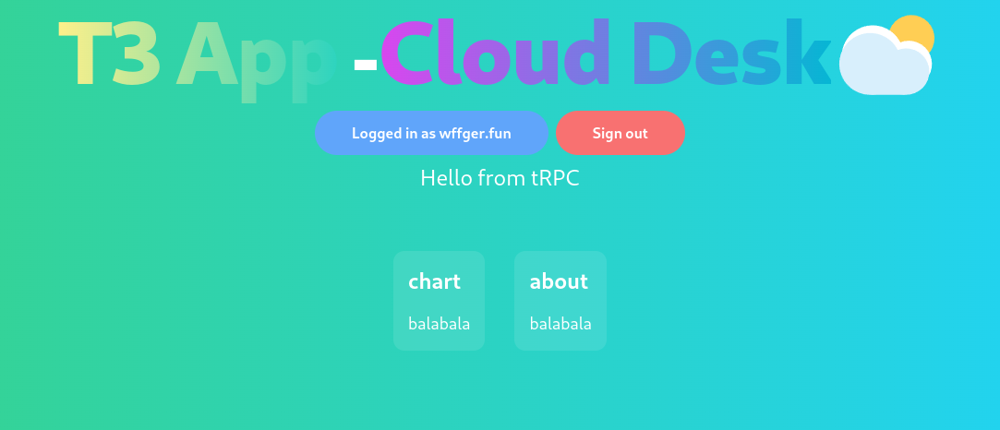

# t3 pretty

This is a [T3 Stack](https://create.t3.gg/) cloud desk app demo.  
用T3工具栈实现的[Cloud Desk](https://github.com/wffger/cloud-desk)。

## Dependencies 依赖

- [Next.js](https://nextjs.org)
- [NextAuth.js](https://next-auth.js.org)
- [Prisma](https://prisma.io)
- [Tailwind CSS](https://tailwindcss.com)
- [tRPC](https://trpc.io)

## Update 更新

使用AppLayout.tsx实现统一布局  
[使用AWS Cognito作为身份供应商](https://thinkindawn.pages.dev/t3app%E4%BD%BF%E7%94%A8aws-cognito/)  

## View 界面

